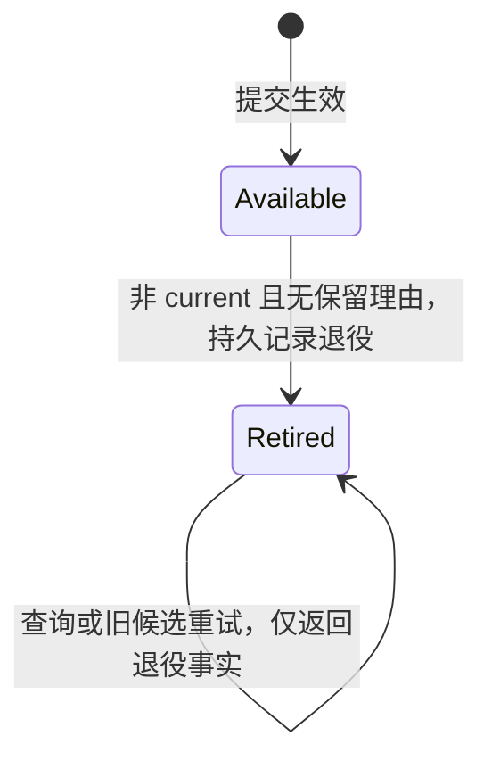

# 保留、退役与回收设计

本文描述当前已实现版本及其阶段约定。[治理规范草案 0.1](spec/README.md) 定义后续目标；逻辑身份与路径分离已在 v3 实现，登记、公开选择和依赖保留仍是后续目标。

状态：分阶段实现中，2026-09-24。**v3 版本门槛、具名引用、对象复用、控制元数据回收预览、退役及可恢复物理回收已实现。** 当前可执行能力以 [API 文档](api.md) 和 [协议 v3](protocol-v3.md) 为准，候选放弃和私有文件清理已实现；未知孤儿自动清理和元数据压缩仍待实现。失败场景及验收要求见 [场景推演](retention-scenarios.md)。

## 1. 交付边界与关键决定

当前已交付具名保留引用、同仓同数据集对象复用和只读取控制元数据的回收预览。当前还支持退役、逐文件删除和中断恢复。完整审计、外部目录持久登记、跨仓库依赖和共享挂载资格另行推进。

本设计采用以下决定：

- 普通绑定仍不产生保留；引用由任务明确创建和释放，不设隐式租约、心跳或析构释放。
- 引用记录固定指向一次发布。首版不支持原地改指向；替换需求先建立新名字的引用，成功后再释放旧引用。
- 引用通过单调 revision 处理竞争、重试和名字复用；释放后留下小型记录，不删除名字的版本历史起点。
- current、具名引用和保留策略保护发布；可恢复候选另外保护其对象。已提交候选的残留记录不构成永久保留根。
- 发布退役与文件删除分开。先持久化退役事实，再删除无其他使用者的文件；旧提交身份不因回收而重新可用。
- 回收按对象集合计算，不以“候选目录属于某次发布”为删除依据。
- 回收预览不是执行授权文件；执行重新计算，恢复最多处理原操作范围内仍可回收的部分。
- 引用和退役需要新的仓库协议版本。旧写入器必须拒绝新仓库，不能继续忽略保留元数据。

核心只承诺遵守协议的管理行为。引用阻止后续 GC，不证明文件没有被外部修改、删除或损坏。

## 2. 三类状态分别表达

### 2.1 发布

发布有持久生命周期状态 `available` 和 `retired`。`current` 是发布被当前指针选中的角色，不是第三种生命周期状态。`available` 表示尚未按协议退役，不代表内容审计通过。



退役不可撤销。current 永远不能退役；具名引用指向的发布不能退役。需要重新生产相同业务数据时使用新发布 ID，不能复用已退役身份。

发布没有简单的全局 `deleted` 标志：它的对象可能与其他发布共享，退役后仍有一部分文件存在。实际删除进度属于回收操作报告。

### 2.2 引用名字

```text
不存在（revision=0）
  → active（revision=1，固定目标）
  → released（revision=2，保留原目标）
  → active（revision=3，可以选择新目标）
```

每次实际变更 revision 加一，不因释放而归零。首版不清理 released 记录，避免旧任务误操作重新使用的名字。两个不同名字引用同一发布，彼此独立。

### 2.3 候选与回收操作

未提交且已封存的候选仍有恢复价值，即便其 generation 已过期，也不会仅凭年龄或冲突状态自动丢弃。它的声明对象参与保护；未封存候选也必须先显式放弃，才能按固定计划清理私有暂存/安装目录。

已提交候选通过 current、历史记录或退役记录识别，不再作为独立保留根。其来源说明不会自动使历史发布永久存活。

回收操作状态为 `planned → running → complete`，遇到矛盾或失败记录 `blocked`，允许显式恢复。操作状态只是进度提示：恢复仍以原计划、实际发布状态和当前保留关系为依据。

## 3. 具名引用 API（已实现）

治理接口集中在 `Repository.retention`，由 `retention` 子包实现。取得此服务对象不执行 I/O，不在 Repository 上不断增加平铺的运维方法。现有 `Reference` 仍是名字和目标的值对象。

| 接口 | 语义 |
| --- | --- |
| `retain(name, dataset_id, *, publication_id=None, expected_revision=0, durable=True)` | 在协调下选定目标并创建持久引用，返回 `RetainedPublication` |
| `get(name)` | 返回 `ReferenceRecord` 或 None；released 记录可查询 |
| `open(name, *, expected_revision)` | 验证该版本引用仍为 active，返回目标绑定和引用记录 |
| `release(name, *, expected_revision, durable=True)` | 仅释放调用者指定的 active revision，返回 released 记录 |
| `preview(policy)` | 返回回收预览；不退役、不删除、不写回收操作记录 |

以上接口已通过 Repository.retention 提供。`RetainedPublication` 包含 `reference`、`revision`、`binding`；没有析构副作用，也不在退出上下文时自动释放。`ReferenceRecord` 还包含 `state` 和下述原始选择方式。

`retain(..., publication_id=None)` 在持有数据集提交锁期间解析 current，并在释放锁前安装引用。因此能将“选择当前发布”和“登记保护”作为一次协调操作。显式传入 ID 时保留指定的已提交发布。

默认创建只接受尚不存在的名字（expected_revision=0）。释放后复用名字必须读取 released revision，再明确传入；不能将“记录已释放”当作从未存在。revision 必须是整数，不能是布尔值。

当前用法：

```python
held = repository.retention.retain("training/run-17", "prices")
try:
    paths = held.binding.files()
    # 完成原生读取器、延迟查询或后台任务的全部文件访问。
finally:
    repository.retention.release("training/run-17", expected_revision=held.revision)
```

引用保护持续到显式释放。若另一个被授权的调用者释放同一 revision，旧绑定不会继续自动受保护；名字不是身份认证。独立消费者应使用不同名字，不能把一个共享名字当作多个读者的计数器。

### 3.1 引用重试与名字复用

每条 active 记录还保存创建请求的选择方式 `selection`：`current` 或 `publication`。后者的发布 ID 就是记录的目标；前者同时保存首次选中的具体发布 ID。

创建请求针对 expected_revision=r：

- 当前为不存在的 r=0，或 released/r：解析目标并原子写 active/r+1。
- 当前为 active/r+1，且数据集和选择方式/显式目标与原请求相同：作为同一创建的重试，返回原目标；current 即使已经变化，也不重新选取。
- 其他状态或 revision：返回 `ReferenceConflictError`，不猜测调用者是否愿意覆盖。

释放请求针对 active revision=r：

- 当前为 active/r：原子写 released/r+1，保存原目标及 selection。
- 当前已是 released/r+1：幂等返回，但 durable=True 的重试仍需同步现有记录。
- 其他情况：冲突。特别是名字已重建为 active/r+2 时，旧释放请求不能删除新引用。

这提供当前名字状态范围内的可识别重试，不提供无限操作历史。若其后已有别的变更，延迟重试可以明确冲突；调用者查询状态，不自动创建或释放其他版本。

## 4. current_only 与 versioned

本阶段引用只接受库管理的发布。外部绑定没有登记在仓库中，不可直接转成此种持久保留。

| 操作 | 受管 current_only | 受管 versioned |
| --- | --- | --- |
| 普通打开当前发布 | 允许 | 允许 |
| 普通按 ID 打开旧发布 | 继续拒绝 | 未退役时允许，无自动保留 |
| 新建引用 | 首次创建时只能选择当时的 current | 可以选择尚未退役的已提交发布 |
| 重试原来的创建请求 | 返回原引用，即使目标现在已是历史 | 相同 |
| 打开已存在的 active 引用 | 允许读取这个明确保留的目标 | 相同 |
| 没有任何保护的旧绑定 | 可能在后续 GC 后读取失败 | 相同 |

允许通过 active 引用重开 current_only 的目标，是针对**当前受管写入使用新路径且不覆盖旧对象**的显式保护路径，不是开放任意历史查询。这里不改变数据集的 PhysicalHistory 值，也不承诺未被选中保留的历史。

未来原地覆盖的外部 current_only 数据不能沿用上述字节保护保证；其引用至多保护登记元数据或阻止库删除，不能阻止外部生产者覆盖。外部模式必须单独声明，不能由目录形状推断。

引用建立默认检查仓库格式、目标身份、退役状态和受管对象声明，**不逐文件 stat 或读取内容**。存在性或内容审计由 inspection 显式执行。保护是防止遵守协议的后续删除，不是给现有数据签发健康证明。

## 5. 对象复用的约束

无需为这一步引入强制内容 hash 或每文件一份控制记录。受管对象的稳定身份可继续使用 `.asterstore/objects/<创建候选 ID>/<逻辑键>`。创建者身份只决定路径，不能被解释为对象只能属于该候选产生的发布。

当前 v3 复用实现已放宽 PublishedRecord 的命名空间约束：一次发布可引用多个创建候选的对象，但每个对象必须通过仓库内已提交的来源声明取得，不能接受任意相对路径作为受管共享对象。

v3 候选记录显式区分新文件逻辑键 `keys` 和 `reused_objects`；复用项包含对象 key 和来源发布 ID。来源数据集由候选的数据集确定。封存后两者共同决定最终成员集合，避免功能启用时再次无提示改变记录含义。当前编解码样例见 [协议 v3](protocol-v3.md)。

首轮复用限定同仓库、同数据集。候选在仓库共享锁下检查来源可用性和成员关系；默认不复制、不探测或读取内容、不同步共享数据；共享对象沿用来源的持久性，本候选 durable=True 不升级来源的字节保证。封存记录保存新对象和复用对象的完整集合，使进程退出后仍能保护复用对象。未封存会话持有共享锁，因此 GC 无法在它运行期间开始；进程退出后的未封存候选不可恢复。

如果来源发布已经退役，即使文件仍由别的发布使用，也不能通过退役来源重新引入对象。可从其他尚未退役且有权限使用的来源声明选择。current_only 的来源选择也遵守当前或已有 active 引用的边界。

已提交新发布只要求其对象存活，不要求其全部来源发布永久保留。来源记录与明确的保留依赖分开；本轮不实现发布间保留依赖图，也不忽略未来无法理解的依赖字段。

## 6. 回收预览

首版策略保持小而明确：`CollectionPolicy(datasets=(...), keep_last=1)`。datasets 必须明确且非空；keep_last 至少为 1，按已提交、尚未退役发布的 generation 排序取最近 N 个，包含 current。先选最近 N 个，再与引用目标取并集；较旧引用不会挤掉最近 N 个中的任何一个。不按文件 mtime 推断发布顺序。

本轮不提供自动按年龄清理候选、自动遗忘发布 ID 或目录 glob 删除。数据集删除和 current 删除也不在范围内。

预览在仓库 GC 独占锁下读取控制记录，获得一个不与发布、引用变更或候选写入交错的观察。代价是等待活跃写入结束，并在扫描期间阻止新写入；普通读取继续运行。预览不创建仓库，也不改治理记录；锁基础设施可能创建锁文件。

令：

- A 为全仓尚未退役的已提交发布，current 与同一份历史档案先按身份去重并核对一致性。
- R 为选定数据集中，不被 current、active 引用或 keep_last 保护的发布。
- C 为尚未提交且已封存候选的对象集合，包括基准已过期但尚未显式放弃的候选。
- T 为选定数据集中已经退役的发布；D 为完成回收记录中确认 deleted/missing 的对象。
- Objects(X) 为集合 X 的声明对象并集。

```text
surviving_objects = Objects(A - R) ∪ C
reclaimable_objects = (Objects(R) ∪ Objects(T)) - D - surviving_objects
```

扫描保留关系时读取全仓元数据，即使策略只选择一个数据集，也不能把其他数据集正在使用的对象当作无人使用。当前先限制同数据集复用，但算法不依赖这个限制来删除对象。

current、active 引用和未选定数据集的 available 发布全部留在 A-R。候选能保护对象而不阻止其来源发布退役；之后候选恢复依据自己的已封存声明使用对象，不能要求来源发布永久可打开。

预览报告包括：所用策略、拟退役发布、可回收对象键、每项保留/退役理由、未决回收操作、发现的问题，以及 `complete/blocked`。对象计数去重；默认不报告精确字节数，因为得到该数通常需要文件探测。需要容量审计时另行显式扫描。

格式未知、损坏的引用、缺失的引用目标、current 缺失但历史存在、互相矛盾的身份或无法理解的对象归属，均令预览 `blocked`。当前区分完整和未完成的 collections 日志；只将未决操作列入 pending_operations 并阻塞新计划，损坏日志仍会阻塞。首版保守阻止整次执行，不尝试猜出一个“可能安全”的局部删除集合；可以展示已收集事实，但不能把不完整列表标记为可执行计划。

无对应发布/候选证据的对象、未声明文件、未封存暂存目录和锁文件不进入上述删除集合。这些数据不进入发布 collect 集合；已有候选的私有残留可以显式 abandon 后调用 cleanup_candidate 清理。未知孤儿只报告，仍不靠年龄判断活跃性。

## 7. 退役、删除与恢复（已实现）

当前执行接口为 `collect(policy)`，返回 `CollectionResult`；恢复接口为 `resume_collection(operation_id)`。不接收调用者提供的任意文件删除列表，也不接受旧 preview 作为权威依据。

### 7.1 执行顺序

1. 获取仓库 GC 独占锁；若有未完成回收，要求先恢复，首版不并行执行多份删除计划。
2. 重新扫描控制记录并计算退役和回收集合；遇到阻塞问题停止。
3. 同步此次判断依赖的控制记录及目录，包括 current、引用的 active/released 记录、候选和历史。这样此前 durable=False 的指针/释放记录不会因本次删除而产生未持久化的保护依据。
4. 持久写入回收计划：操作 ID、策略、待退役发布身份/原 generation、原对象集合及允许处理的确切文件键。计划必须在任何退役前可恢复。
5. 将拟退役发布的历史记录原子替换为小型退役记录，并完成持久同步。**全部本次决定退役的目标都成功记录后**才进入物理删除；失败则停止。
6. 在锁内再次确认待删除键没有保留理由，只处理计划内无使用者的受管文件。逐文件删除并同步目录；当前连空对象目录也保留，不递归删除整个候选目录。
7. 持久记录结果、失败和完成状态，释放锁。

执行与恢复强制持久化，不提供 durable=False。没有必要同步历史数据内容来计算可达性；此前弱持久性写入的内容保证不会被 GC 自动升级。第 3 步同步的是防止旧控制状态回滚后重新指向已删文件所必需的元数据。

文件删除处才做路径归属、类型和必要父目录检查。未知文件和符号链接不跟随删除；报告并阻塞相关操作。该检查用于避免普通误操作，不宣称能抵御恶意并发文件系统修改。

### 7.2 回收中断

退役记录一旦可见，新的引用和来源复用就不能选择该发布，即使其文件还存在。当前发布和已有引用在退役判定时已经被排除。

恢复重新获取独占锁，核对计划和实际记录，再读取最新保留关系。原计划中尚未退役、后来被新引用保护的发布被跳过；已退役事实不回滚。可删除集合始终限于原计划，减去当前仍被使用的对象，不扩大到新出现的发布或文件。

计划中已经不存在且不再被使用的文件可以视作已处理，但仍要同步相关目录；受保护对象跳过删除、不做健康审计，protected 报告不证明文件存在；若读取发现缺失应按数据损坏处理，不能据此修改声明。报告区分实际删除、发现已不存在、后来受到保护、失败和剩余。

进度记录允许落后于 unlink；恢复不能仅凭“完成了第几个文件”跳过状态检查。计划在执行中不可压缩丢失，完成记录首版也保留。候选恢复、正常发布和引用变更在回收中断后可以继续，只要它们识别退役状态；新的 collect 先处理未完成操作。

### 7.3 旧提交的查询和重试

- 同一候选已提交且发布仍 available：保持现有幂等返回行为。
- 发布已 retired：候选状态返回 `retired`；commit/resume 明确抛出 `PublicationRetiredError`，附带原提交身份，不返回一个看似仍可用的 Publication。
- 其他候选试图使用该发布 ID：`PublicationConflictError`，不会因文件已删而获准重用。
- 历史打开读到退役记录：返回 `PublicationRetiredError`，不回退 current，也不返回假空发布。

对未受保留保护的普通读取，存在“读取声明后、实际读取数据前被退役/删除”的窗口。这是刻意保留的低成本边界；需要消除此窗口的任务先 retain，再使用其返回的绑定。

## 8. 持久记录和版本边界

引用和预览已经使用仓库协议 v3；本节的退役记录及 collections 布局也已实现。旧格式的当前发布和绑定行为由 v1 文档说明；不能直接向 v1 仓库添加引用然后声称旧写入器会尊重它们。

```text
.asterstore/
├── format.json                               # v3 仓库门槛
├── references/<sha256(name)>.json              # active 或 released，含 revision
├── locks/references/<sha256(name)>.lock        # 不删除/替换
├── datasets/<dataset_hash>/
│   ├── current.json                           # 仍是完整发布声明
│   └── history/<publication_hash>.json        # 完整发布或退役记录
└── collections/<operation_id>/
    ├── plan.json                              # 不可变操作范围
    └── progress.json                          # 可恢复的进度与结果
```

沿用严格 UTF-8 JSON 和 kind/version 校验；以下引用字段样例已支持；retired_publication 样例也已由严格编解码器支持。引用 selection 固定为 current/publication 两种之一。

```json
{
  "format_version": 2,
  "kind": "retention_reference",
  "name": "training/run-17",
  "revision": 1,
  "state": "active",
  "selection": "current",
  "dataset_id": "prices",
  "publication_id": "p17"
}
```

released 使用同一结构，保留目标和 selection，只改变 state 和递增 revision。它不会仍作为 GC 根。

```json
{
  "format_version": 2,
  "kind": "retired_publication",
  "dataset": {"dataset_id": "prices", "physical_history": "current_only"},
  "publication_id": "p17",
  "generation": 17,
  "candidate_id": "0123456789abcdef0123456789abcdef",
  "collection_id": "fedcba9876543210fedcba9876543210"
}
```

退役记录替换同一路径的历史记录，不再包含完整对象列表；删除依据已先写入回收计划。历史读取一次即可区分完整发布与退役，无需给每次 current 读取加一份独立退役索引。current 在整个生命周期中不能是退役记录。

首版保留退役记录、released 引用、完成操作和候选状态，承认元数据会增长。后续可以将已退役发布对应候选的完整清单压缩为提交凭据，但不能直接删除身份占位。候选按 ID 查到数据集/发布的反向信息，以及发布 ID 的已使用事实，都必须保留。元数据压缩单独设计和测量，不在本轮冒充已解决。

当前新仓库使用 v3；旧 v1/v2 仓库不自动升级，治理变更报 `RepositoryUpgradeRequiredError`。v2 已有引用仍可查询和打开。迁移工具另行实现、备份并离线验证；发布迁移工具前仅对新建 v3 仓库启用治理写入。旧库看到 v3 标记必须在产生治理变更前拒绝。

仅取得 GC 锁不足以证明在线迁移安全：旧版 writer 可能在等锁前已检查 v1 标记。升级必须停止旧进程，新版所有治理变更在获取仓库锁后重新检查格式。迁移中断的标记和恢复流程未定义前，不开放原地升级命令。

## 9. 锁顺序与持久性

| 操作 | 获取顺序 | 何时释放 |
| --- | --- | --- |
| 候选写入/恢复 | 仓库共享 → 候选独占 → 提交时数据集独占 | 候选上下文退出；数据集锁在提交结束释放 |
| retain | 仓库共享 → 引用名字独占 → 数据集独占 | 目标选择和引用写入/同步完成 |
| release | 仓库共享 → 引用名字独占 | 写入/同步完成 |
| 引用 open | 仓库共享 → 引用名字共享 → 数据集共享 | 检查引用版本并构建绑定后 |
| preview / collect / 恢复回收 | 仓库独占 | 观察或操作结束 |
| 普通 open / files | 无治理锁 | 不适用 |

禁止持有数据集锁后再获取引用或候选锁，也不进行共享锁到独占锁的原地升级。跨数据集引用切换未实现，避免引入多数据集锁顺序。

引用变更的可见性点是单个名字记录的原子替换，durable=True 完成同步后才确认。替换后同步失败仍可能已经可见；同一 revision 请求重试时先识别结果，再补齐持久同步。新建引用若选择了此前弱持久发布，需同步选中的提交证据、格式和目录；引用不会替应用重新同步全部内容或承诺额外内容保证。

preview 使用独占锁换取简单一致的元数据观察，存在等待和阻塞写入成本。首版接受这一点，先测量再考虑分代快照或写入登记，普通读取无需为此付费。

所有锁是合作协议。本地进程测试、SIGKILL 和注入异常不能替代断电、NFS 多客户端及服务器故障验证。

## 10. 模块职责和实现顺序

| 模块 | 本设计中的职责 |
| --- | --- |
| metadata | 引用/退役/回收记录，版本化编解码，纯值对象 |
| storage | 路径、原子替换、持久同步、锁、控制记录访问 |
| retention | 引用服务、可达性计算、预览、退役与回收恢复 |
| publishing | 复用对象的封存与恢复；识别退役候选及已使用 ID |
| reading | 绑定完整发布，识别退役记录；保持普通路径选择无 I/O |
| inspection | 已实现候选残留路径/字节诊断；完整数据格式与内容检查仍待实现 |
| repository | 装配 retention 服务，保留现有简洁入口 |

实现顺序：

1. v2 记录样例与纯模型、版本门槛、引用 revision 状态机、current_only 引用语义；保留 v1 格式读取的明确边界。
2. 具名引用、受保护绑定、元数据扫描与 preview。只交付真实能力，不导出 collect 占位方法。
3. 已实现：同仓同数据集对象复用；封存候选保护共享对象；保持预览算法按对象并集工作。
4. 已实现：执行日志、退役、逐文件回收、恢复与候选重试适配；collect 与 resume_collection 已导出并通过故障场景验证。
5. 已实现显式候选放弃、残留诊断和私有文件清理，见 [候选残留治理](candidates.md)。元数据压缩、未知孤儿自动处理、外部登记和保留依赖后续分别验收。

每一步记录绑定 I/O 数量、控制清单规模、发布新增字节、锁等待和运维扫描成本。新增基准应与直接路径读取及同一数据规模比较，不能从没有逐文件校验推导吞吐提升倍数。
